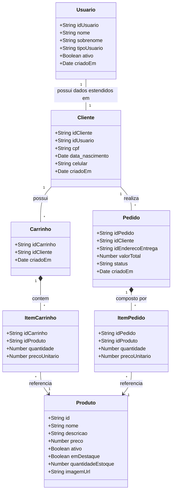

# Diagrama de Classes de Domínio

Este documento apresenta o modelo de classes do domínio principal da aplicação `raito-corp-front`. Ele ilustra as entidades principais e seus relacionamentos.

```mermaid
classDiagram
    %% Classes de Cadastro
    class Usuario {
        +String idUsuario
        +String nome
        +String sobrenome
        +String tipoUsuario
        +Boolean ativo
        +Date criadoEm
    }

    class Cliente {
        +String idCliente
        +String idUsuario
        +String cpf
        +Date data_nascimento
        +String celular
        +Date criadoEm
    }

    %% Relacionamento Usuario - Cliente (1:1)
    Usuario "1" -- "1" Cliente : possui dados estendidos em

    %% Classes de Catálogo
    class Produto {
        +String id
        +String nome
        +String descricao
        +Number preco
        +Boolean ativo
        +Boolean emDestaque
        +Number quantidadeEstoque
        +String imagemUrl
    }

    %% Classes de Vendas (Carrinho)
    class Carrinho {
        +String idCarrinho
        +String idCliente
        +Date criadoEm
    }

    class ItemCarrinho {
        +String idCarrinho
        +String idProduto
        +Number quantidade
        +Number precoUnitario
    }

    %% Classes de Vendas (Pedido)
    class Pedido {
        +String idPedido
        +String idCliente
        +String idEnderecoEntrega
        +Number valorTotal
        +String status
        +Date criadoEm
    }

    class ItemPedido {
        +String idPedido
        +String idProduto
        +Number quantidade
        +Number precoUnitario
    }

    %% Relacionamentos de Carrinho
    Cliente "1" -- "*" Carrinho : possui
    Carrinho "1" *-- "*" ItemCarrinho : contem
    ItemCarrinho "*" --> "1" Produto : referencia

    %% Relacionamentos de Pedido
    Cliente "1" -- "*" Pedido : realiza
    Pedido "1" *-- "*" ItemPedido : composto por
    ItemPedido "*" --> "1" Produto : referencia
```